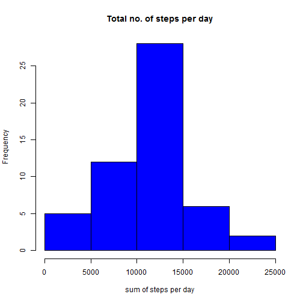
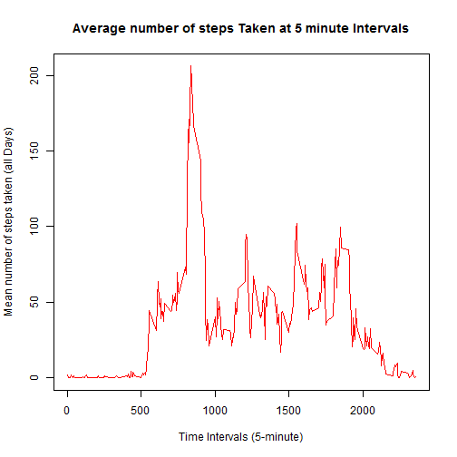
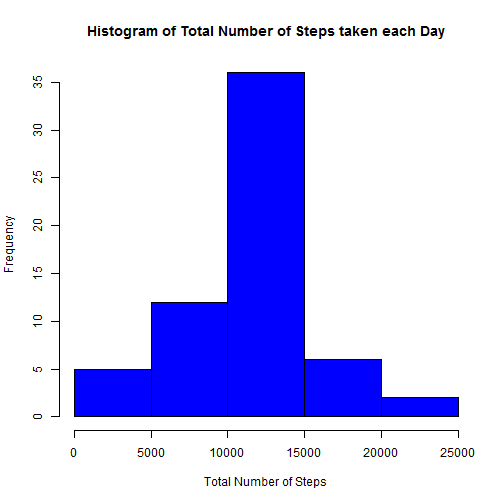

## Loading and preprocessing the data

```r
temp <- unz("activity.zip","activity.csv")
activity <- read.csv(temp, header = T, sep = ",")
totalsteps <-aggregate(steps ~ date, activity, sum, na.rm = TRUE)
```


## What is mean total number of steps taken per day?
#### 1. Make a histogram of the total number of steps taken each day

```r
hist(totalsteps$steps,col="blue", xlab = "sum of steps per day", main = "Total no. of steps per day")
```

 

#### 2. Calculate and report the mean and median total number of steps taken per day

```r
mean_totalsteps <- round(mean(totalsteps$steps))
median_totalsteps <- round(median(totalsteps$steps))
```
Mean total number of steps taken per day is 1.0766 &times; 10<sup>4</sup>.
Median total number of steps taken per day is 1.0765 &times; 10<sup>4</sup>.


## What is the average daily activity pattern?
#### 1. Make a time series plot of the 5-minute interval (x-axis) and the average number of steps taken, averaged across all days (y-axis)

```r
stepsPerinterval <- aggregate(steps ~ interval, data = activity, mean, na.rm = TRUE)
plot(steps ~ interval, data = stepsPerinterval, type = "l", xlab = "Time Intervals (5-minute)", ylab = "Mean number of steps taken (all Days)", main = "Average number of steps Taken at 5 minute Intervals",  col = "red")
```

 
#### 2. Which 5-minute interval, on average across all the days in the dataset, contains the maximum number of steps?

```r
MaxStepInterval <- stepsPerinterval[which.max(stepsPerinterval$steps), ]$interval
```
Maximum number of steps is contained in the 835  5-minute interval.


## Imputing missing values

#### 1. Calculate and report the total number of missing values in the dataset 

```r
missingValues <- sum(!complete.cases(activity))
```
Total number of missing values in the dataset is 2304.

#### 2. Devise a strategy for filling missing values
Missing values will be replaced with mean for that 5-minute interval using the following function

```r
MeanStepsPerInterval <- function(interval){
stepsPerinterval[stepsPerinterval$interval==interval,"steps"]
}
```

#### 3. Create a new dataset that is equal to the original dataset but with the missing data filled in.

Filling the missing values with the mean for that 5-minute interval

```r
noNull_activity <- activity
flag = 0
for (i in 1:nrow(noNull_activity)) {
    if (is.na(noNull_activity[i,"steps"])) {
        noNull_activity[i,"steps"] <- MeanStepsPerInterval(noNull_activity[i,"interval"])
        flag = flag + 1
        }
    }
```
Total 2304 values were filled in.

#### 4. Histogram, Mean, Median
###### Make a histogram of the total number of steps taken each day

```r
totalStepsPerDay <- aggregate(steps ~ date, data = noNull_activity, sum)
hist(totalStepsPerDay$steps, col = "blue", xlab = "Total Number of Steps", 
     ylab = "Frequency", main = "Histogram of Total Number of Steps taken each Day")
```

 

###### Calculate and report the mean and median total number of steps taken per day

```r
newMean <- round(mean(totalStepsPerDay$steps))
newMedian <- round(median(totalStepsPerDay$steps))
```
Mean steps taken per day in new dataset is 1.0766 &times; 10<sup>4</sup>.
Median steps taken per day in new dataset is 1.0766 &times; 10<sup>4</sup>.

###### Do these values differ from the estimates from the first part of the assignment?
The mean steps per day is same but median steps per day have changed.

###### What is the impact of imputing missing data on the estimates of the total daily number of steps?
The mean and median have become same because of imputing data.


## Are there differences in activity patterns between weekdays and weekends?
#### 1. Create a new factor variable in the dataset with two levels – “weekday” and “weekend” indicating whether a given date is a weekday or weekend day.

```r
noNull_activity$day <- ifelse(as.POSIXlt(as.Date(noNull_activity$date))$wday%%6 == 
                                    0, "weekend", "weekday")
noNull_activity$day <- factor(noNull_activity$day, levels = c("weekday", "weekend"))
```
#### 2. Make a panel plot containing a time series plot (i.e. type = "l") of the 5-minute interval (x-axis) and the average number of steps taken, averaged across all weekday days or weekend days (y-axis).

```r
steps_interval= aggregate(steps ~ interval + day, noNull_activity, mean)
library(lattice)
xyplot(steps ~ interval | factor(day), data = steps_interval, aspect = 1/2, 
       type = "l")
```

 
